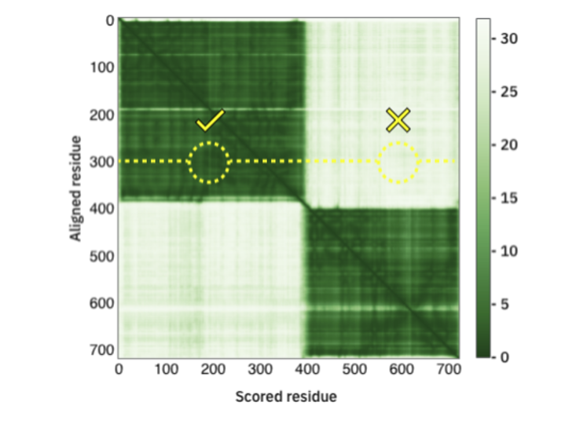
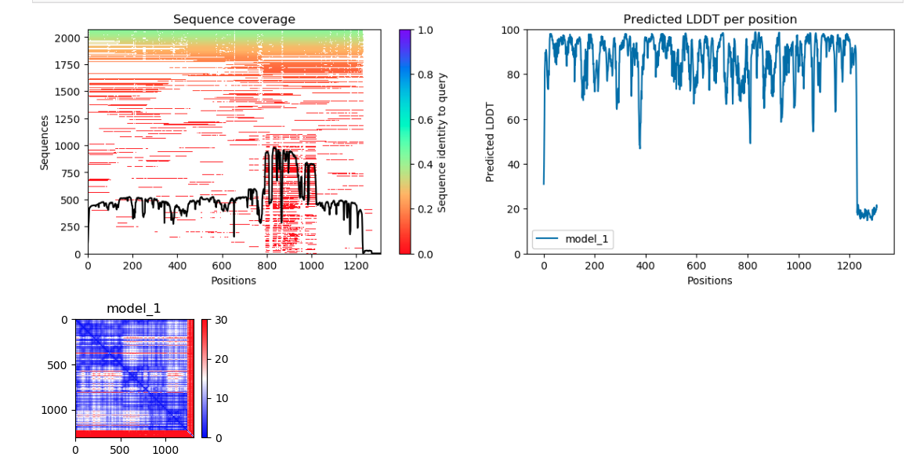

## AlphaFold2 Accuracy Assessment

We can assess the accuracy of the AlphaFold prediction using:

- **Predicted Local Distance Difference Test (pLDDT)**
- **Predicted Alignment Error**

## Predicted Local Distance Difference Test (pLDDT)

- per-residue confidence metric  ranging from 0-100 (100 being the highest confidence)
- Regions below 50 could indicate disordered regions


## Predicted Alignment Error (PAE)

- The Predicted Alignment Error (PAE) gives us an expected distance error based on each residue.
- If we are more confident that the distance between two residues is accurate, then the PAE is lower (darker green). If we are less confident that the distance between two residues is accurate, the PAE is higher (lighter green)



## Set Up For Analysis

- To get our AlphaFold data we will enter:


```bash
#code being updated in the notebook
```

- Now let's go into this folder with the following command:

```bash
#code being updated in the notebook
```

- Given that AlphaFold2 can take anywhere from a few hours to a few days to run - AlphaFold2 predictions have already been generated for the Cas12a-CWF mutants from our study. We will use a script from the [VIB Bioinformatics Core](https://elearning.bits.vib.be/courses/alphafold/lessons/alphafold-on-the-hpc/topic/alphafold-outputs/) to visualize the accuracy of AlphaFold2's predictions. First we will need to load the software needed to run that script:

```bash
#code being updated in the notebook
```

- Now we will need to feed our script three arguments:
    
    - `--input_dir` input directory with model files 
    - `--output_dir` output directory to put our plots of model information
    - `--name` optional prefix to add to our file names


```bash

#code being updated in the notebook

python af2_accuracy_viz.py --input_dir mut2cwf/5XUS_mut2cwf --output_dir ./ --name mut2cwf
```

- Running this will generate two images in your current directory:

    - `mut2cwf_coverage_LDDT.png` - plots of your msa coverage and pLDDT scores per residue per model
    - `mut2cwf_PAE.png` - plots of your predicted alignment error 

- The following is are the pLDDT and PAE scores for the Cas12a-CWF mutant:



- You'll note that for the pLDDT plots, that the multiple sequence alignment is plotted with a bar on the side to tell you how similar those sequences were to your query sequence (in this case each of the Cas12a-CWF mutant)

??? question "Do you see a region in the MSA plot that seems more conserved? How about less conserved?"

??? question "How does this coverage seem to affect the confidence in each residues position in the pLDDT plots? "
