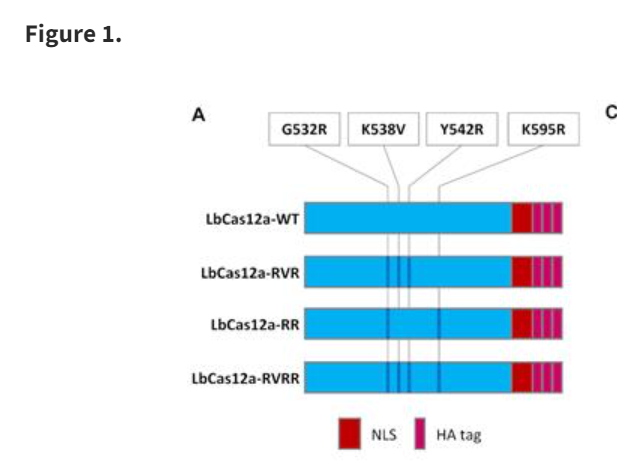

## Cas12a Variant Structural Predictions With AlphaFold2 

!!! info ""

    Presented as a Virtual Tutorial for the ISMB 2023 Meeting in Lyon, France

## The Intrepid Trainers

- [Geraldine Van de Auwera, Ph.D.](https://www.linkedin.com/in/geraldine-van-der-auwera-5a5811/)
  Independent Consultant and Author of "Genomics in the Cloud"
- [Adelaide Rhodes, Ph.D.](https://www.linkedin.com/in/adelaide-rhodes-ph-d-376b9133/)
  Senior Bioinformatics Engineer and proud owner of Blue

## Prerequisites

- [Request a free Gmail](https://support.google.com/mail/answer/56256?hl=en-EN) account to enable the Colaboratory Demo

  -  [FAQ for Colaboratory](https://research.google.com/colaboratory/faq.html)

- [Download PyMOL](https://www.pymol.org/2/#download)

## Schedule

## Workshop Schedule 

### Note: Times are relative to the start and end times of the Tutorial

0:00:00 - 0:15:00 Introductions  

0:15:00 - 0:30:00 Introduction to the AlphaFold Tools and Database 

[Basics of AlphaFold](./Basics_of_AlphaFold.md)

0:30:00 - 0:45:00 Setting up Colaboratory Notebooks to run code with a free Gmail account

We are going to use a streamlined version of AlphaFold that is available on publicly available notebooks with free compute resources. A gmail account is required for the initial sign in.

[ColabFold](https://colab.research.google.com/github/sokrypton/ColabFold/blob/main/AlphaFold2.ipynb)

0:45:00 - 1:45:00 Hands On Activity 

* Introduction to the Data Sets used 

[Introduction To Cas12a Variant Structural Predictions With AlphaFold2](./01_CRISPR-Cas_Structural_Predictions_with_AlphaFold2.pdf)

[A second Cas12a mutant model](https://academic.oup.com/nar/article/48/7/3722/5763098#supplementary-data)

* Introduction to the Compute Environment

  * How to use a Google Colaboratory Notebook
  
  * Different Options that can be Found in ColabFold
  
  * Location of protein models from the Cas12a paper(s)

* Introduction to the Alphafold Command Line Parameters
*   View the Code in the [Notebooks](https://colab.research.google.com/github/sokrypton/ColabFold/blob/main/AlphaFold2.ipynb) 
* Run Alphafold using Colaboratory Notebooks

[AlphaFold2 Accuracy Assessment](./02_AlphaFold2_Accuracy_Assessment.md)

* Review Alphafold results (RELAXED vs RELAXED_GPU)
* Download Alphafold results 

If Results were not accessible because of glitches with the notebook or runtime, here are the results that will be used in the next step.

<a href="https://github.com/RareSeas-Asimov/alphafold-tutorial-ismb-2023/blob/main/docs/LbCas12a_wildtype.pdb" title="LbCas12a_wildtype.pdb" download>LibCas12a_wildtype.pdb </a>

<a href="https://github.com/RareSeas-Asimov/alphafold-tutorial-ismb-2023/blob/main/docs/LbCas12a_RVRR.pdb" title="LbCas12a_RVRR.pdb" download>LibCas12a_RVRR.pdb </a>

<a href="https://github.com/RareSeas-Asimov/alphafold-tutorial-ismb-2023/blob/main/docs/LbCas12a_mut2B-W.pdb" title="LbCas12a_mut2B-W.pdb" download>LibCas12a_mut2B-W.pdb </a>

<a href="https://github.com/RareSeas-Asimov/alphafold-tutorial-ismb-2023/blob/main/docs/LbCas12a_mut2B-W_with_template.pdb" title="LbCas12a_mut2B-W_with_template.pdb" download>LibCas12a_mut2B-W_with_template.pdb </a>

1:45:00 - 2:00:00 Coffee Break 

2:00:00 - 2:20:00 Introduction to PyMoL and other Protein Viewers (e.g. Cn3D) 

2:20:00 - 2:30:00 Setting up PyMoL on your own machine 

2:30:00 - 3:30:00 Hands On Activity

[Cas12a Variant Visualization](./03_Cas12a_Variant_Visualization.md)

* Loading files into PyMOL
* Picking residues to highlight 
* Other options in PyMOL for examining the protein structure 

* What have we learned from the visualizations? 
* What other questions might we ask? 

3:30:00 - 3:45:00 Discussion session: How can this tool be applied to your research question? 
3:45:00 - 4:00:00 Wrap up Lecture on Future Directions for AI and Resources for Further Study 

### References

[alphafold-for-everybody](https://towardsdatascience.com/alphafold-for-everybody-c73d40d4b56d)

[alphafold-potential-impacts](https://www.ebi.ac.uk/about/news/perspectives/alphafold-potential-impacts/)

[ColabFold: making protein folding accessible to all](https://www.nature.com/articles/s41592-022-01488-1)

[OpenFold: Retraining AlphaFold2 yields new insights into its learning mechanisms and capacity for generalization](https://www.biorxiv.org/content/10.1101/2022.11.20.517210v2)

[DeepMind's AlphaFold 2 Explained](https://www.youtube.com/watch?v=B9PL__gVxLI)

[5 ways of using Alpha Fold 2](https://www.accurascience.com/blogs_6_1.html?gclid=CjwKCAjw3ueiBhBmEiwA4BhspNPMLM14ceBk4pPtSeLMomYPQghWmgslYa1A5_74mP6cCPjazhxbARoClRMQAvD_BwE)

### Acknowledgements

***Thank you to Tufts Research Technology and Jason Laird for contributing the seeds of this lesson on Alphafold***
